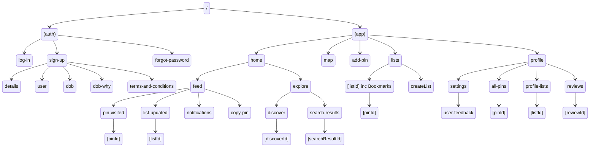

# Mapin

Expo React Native App for Mapin

## 📁 Folder Structure

```
/docs         - Documentation
/shared       - Shared Components
  /assets     - Images, Fonts, etc
  /components - All Components. Most low level components, e.g. Text
  /context    - Contexts used to manage global state. Auth & Data
  /constants  - Constants used throughout the app
  /lib        - Contains Functions, Hooks & Supabase Client
/app          - Routing Folder. Each file becomes a route
  /(app)      - Logged in app
  /(auth)     - Auth Screens
```

## 📱 Screens Overview



## 💾 DataBase

# Schema


## API Structure

| **<br>**           | **Description**                  | **API id** | **Type** | **API Request**                                   | **Policies**                         | **URL** | **Body Keys** |
| ------------------ | -------------------------------- | ---------- | -------- | ------------------------------------------------- | ------------------------------------ | ------- | ------------- |
| **Register/Login** | OAuth Sign in                    | 1          |          |                                                   |                                      |         |               |
| **<br>**           | Register                         | 2          | POST     | POST to Profile to update private details         | User can only edit their own profile |         |               |
|                    | Edit Profile                     | 3          | PATCH    |                                                   |                                      |         |               |
| **Feed**           | Get Feed                         | 4          | GET      | GET Updates for Pins in Lists a user is following |                                      |         |               |
| **<br>**           | Get Pin Info on Feed             | 5          | GET      | GET single Pin Info                               |                                      |         |               |
| **<br>**           | Comment on a Pin                 | 6          | POST     | POST a comment to a Pin                           |                                      |         |               |
| **<br>**           | Copy Pin                         | 7          | POST     | Copy Pin. Update derivation number on Pin         |                                      |         |               |
| **Explore**        | Popular Pins                     | 8          | GET      | GET popular Pins                                  |                                      |         |               |
| **<br>**           | Follow List                      | 9          | POST     | Follow list                                       |                                      |         |               |
| **Map**            | Fetch all Nearby Pins            | 10         | GET      | GET Pins with Filters (List)                      |                                      |         |               |
| **Add Pin**        | Post a new Pin                   | 11         | POST     | New Pin                                           |                                      |         |               |
| **Pins**           | Get ALL Pins                     | 12         | GET      | Get all Pins                                      |                                      |         |               |
| **<br>**           | Get 1 Pin                        | 13         | GET      | Get detail 1 Pin                                  |                                      |         |               |
| **<br>**           | Update 1 Pin as vistied          | 14         | UPDATE   | Update 1 Pin as visited                           |                                      |         |               |
| **<br>**           | Update Pin                       | 15         | UPDATE   | Update detail on 1 pin                            |                                      |         |               |
| **My Lists**       | Get Lists Overview               | 16         | GET      | GET lists                                         |                                      |         |               |
| **<br>**           | Get 1 List Detail                | 17         | GET      | Get 1 list Details                                |                                      |         |               |
| **<br>**           | Get 1 Pin Detail                 | 18         | GET      | Get 1 Pin Detail                                  |                                      |         |               |
| **Profile**        | Pin number, Followers, Following | 19         | GET      | Get Person Details                                |                                      |         |               |
| **<br>**           | Lists- own; get all. else Public | 20         | GET      | Get Lists for Profile                             |                                      |         |               |
| **<br>**           | All Pins (Public/Private)        | 21         |          |                                                   |                                      |         |               |
| **Settings**       | User Feedback                    | 22         | POST     | Send user feedback                                |                                      |         |               |
