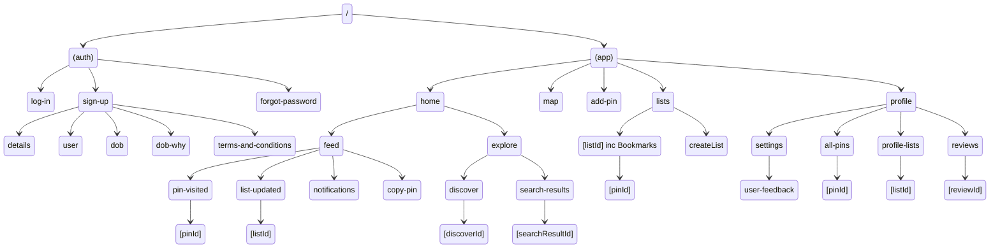

# Mapin

Expo React Native App for Mapin

## File Structure

```
config.ts     - Contains config
/context      - Contexts used to manage global state. Auth & Data
/lib          - Contains Functions, Hooks & Supabase Client
/components   - All Components. Most low level components, e.g. Text
/layout       - Layout components - higher level than components
/app          - Routing Folder. Each file becomes a route
  /(app)      - Logged in app
  /(auth)     - Auth Screens
```

## Screens Overview



## Colors

Light:
BG: background: linear-gradient(to top, #eeeeee 0%, #f4f5fa 100%);
Text: color: rgb(95, 95, 95);

## Scripts

Replace Spaces with Underscores:

```bash
for f in *\ *; do mv "$f" "${f// /_}"; done
```

## 🚀 ToDo

- [ ] Replace Alers with Modal
- [ ] Check ifg username is taken
- [ ] Typography and Fonts
- [ ] Design

- Add user location to auth context
- Add name
- add other details
- Add Feed into data
- Notifications

# Auth

- [ ] On Sign up validate unique username
  - https://supabase.com/docs/guides/database/functions
- [ ] On Sign up validate age over 13
- [ ] On Sign up Implement Gender Select

# Explore

- [ ] Will need to implement a Full Text Search
  - https://supabase.com/docs/guides/database/full-text-search

## 📝 Notes

- [Routing Docs](https://expo.github.io/router/docs/features/routing)
- [Expo Router: Docs](https://expo.github.io/router)
- [Expo Router: Repo](https://github.com/expo/router)
- [Request for Comments](https://github.com/expo/router/discussions/1)

## Routes to add to Website

- https://mapin.co.uk/reset-password
- https://mapin.co.uk/welcome

## Issues

- [Known storage limits of Async Storage](https://react-native-async-storage.github.io/async-storage/docs/limits)
